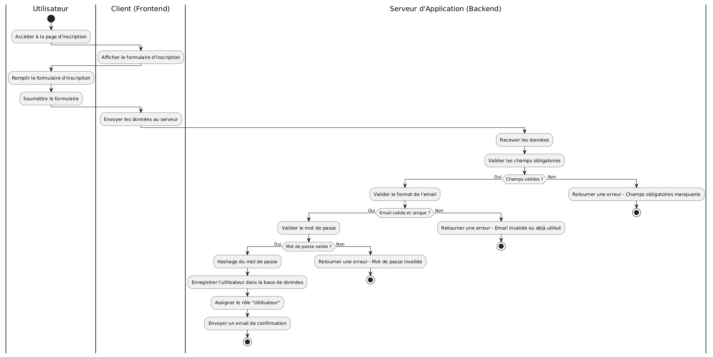
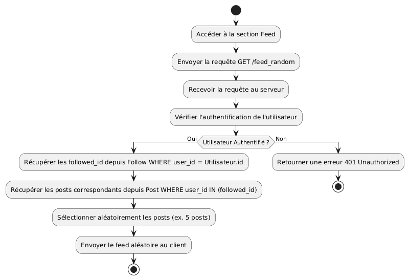

# Diagramme d'activité

## Creation du compte

### Description du processus

- Accès à la Page d'Inscription :
  - L'utilisateur accède à la page d'inscription depuis le client (frontend).
- Remplissage du Formulaire :
  - L'utilisateur saisit les informations requises (nom d'utilisateur, email, mot de passe, etc.).
- Validation des Données :
  - Vérification des Champs Obligatoires : Assurer que tous les champs requis sont remplis.
  - Validation de l'Email : Vérifier que l'adresse email est au bon format et unique.
  - Validation du Mot de Passe : S'assurer que le mot de passe respecte les critères de sécurité.
- Création de l’Utilisateur :
  - Hashage du Mot de Passe : Sécuriser le mot de passe avant de le stocker.
  - Enregistrement dans la Base de Données : Sauvegarder les informations de l'utilisateur.
- Assignation du Rôle par Défaut :
  - Attribuer le rôle "Utilisateur" via l'entité User_Role.
- Envoi de la Confirmation :
  - Envoyer un email de confirmation ou rediriger vers la page de connexion.
- Finalisation :
  - L'utilisateur peut maintenant se connecter avec ses nouvelles informations.

### Diagramme creation du compte

## Feed random

- Demande d’Affichage du Feed :
  - L'utilisateur accède à la section du feed depuis le client (frontend).
- Requête au Serveur :
  - Le client envoie une requête au serveur pour obtenir un feed aléatoire.
- Authentification de l’Utilisateur :
  - Vérifier que l'utilisateur est authentifié.
- Récupération des Suivis :
  - Interroger la table Follow pour obtenir les followed_id (utilisateurs suivis).
- Récupération des Posts :
  - Pour chaque followed_id, récupérer un nombre défini de posts (par exemple, les 5 derniers posts).
- Sélection Aléatoire des Posts :
  - Mélanger les posts récupérés pour créer un feed aléatoire.
- Envoi du Feed au Client :
  - Transmettre le feed aléatoire au client.
- Affichage du Feed :
  - Le client affiche le feed à l'utilisateur.

### Diagramme du feed

