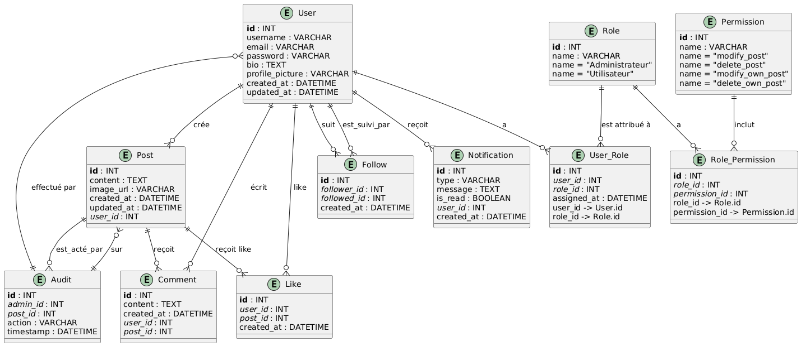

# Diagramme d'associations des entités

## Entités et attributs

### User

- Crée plusieurs Posts.
- Peut suivre et être suivi par d'autres Users via Follow.
- Peut avoir plusieurs rôles via User_Role.

### Post

- Créé par un User.
- Peut être modifié ou supprimé par son propriétaire ou par un administrateur via les permissions.
- Lié à un utilisateur via son `user_id`

### Follow

- Représente les relations de suivi entre utilisateurs
- follower_id est l'utilisateur qui suit, followed_id est l'utilisateur suivi

### Notification

- Représente les notifications reçues par les utilisateurs
- Chaque notification est liée à un utilisateurs via user_id

### Role

- Définit les rôles disponibles (`Administrateur`, `Utilisateur`).

### Permissions

- Définit les actions autorisées (`create_post`, `modify_own_post`, `delete_own_post`, `modify_post`, `delete_post`).

### User_Role

- Associe les Users aux Roles.

### Role_Permission

- Associe les Roles aux Permissions

### Comment

- Permet aux Users de commenter les Posts

### Like

- Permet aux Users d'aimer les Posts

## Relation

- User à Post : Un utilisateur peut créer plusieurs posts (0-N).

- User à Follow : Un utilisateur peut suivre et être suivi par plusieurs autres utilisateurs (N-N via Follow).

- User à Notification : Un utilisateur peut recevoir plusieurs notifications (0-N).

- Role à Role_Permission à Permission : Les rôles peuvent avoir plusieurs permissions et vice versa (N-N).

## Diagramme

