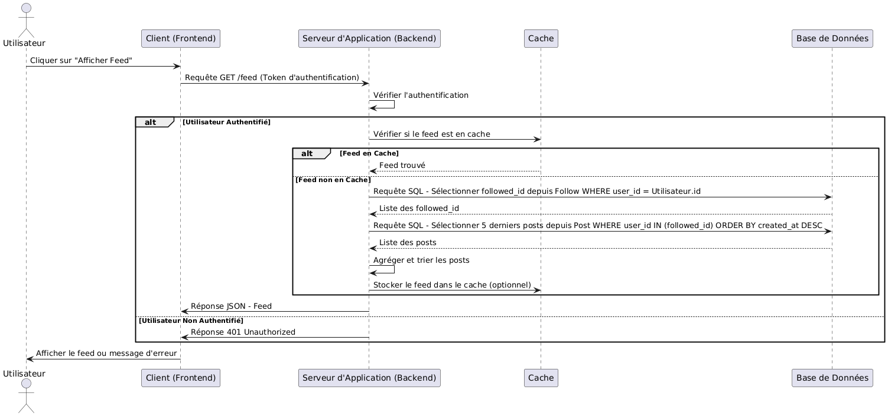

# Diagramme de séquence

## Acteurs et composants

- Utilisateur : L'utilisateur qui souhaite consulter son feed.
- Client (Frontend) : Interface utilisateur où la requête est initiée.
- Serveur d'Application (Backend) : Gère la logique métier et les requêtes.
- Base de Données : Stocke toutes les données relatives aux utilisateurs, posts, abonnements, etc.
- Cache (Optionnel) : Système de mise en cache pour optimiser les performances (Redis).

## Etapes du process

### Demande de Feed

- L'utilisateur clique sur le bouton pour afficher son feed.
- Le Client envoie une requête au Serveur d'Application pour obtenir le feed.

### Authentification de l'Utilisateur

- Le Serveur d'Application vérifie l'authentification de l'utilisateur (par exemple, via un token JWT).
- Récupération des Utilisateurs Suivis

### Récupération des Utilisateurs Suivis

- Le Serveur d'Application interroge la Base de Données pour obtenir la liste des followed_id de l'utilisateur à partir de la table Follow.

### Récupération des Posts

- Pour chaque followed_id, le Serveur d'Application interroge la Base de Données pour récupérer les 5 derniers posts de la table Post triés par created_at décroissant.
- (Optionnel) Si un Cache est utilisé, le Serveur d'Application peut d'abord vérifier si les posts sont disponibles dans le cache avant d'interroger la base de données.

### Agrégation et Tri des Posts

- Le Serveur d'Application agrège les posts récupérés de tous les utilisateurs suivis.
- Les posts sont triés globalement par created_at décroissant pour présenter un flux chronologique.

### Envoi du Feed au Client

- Le Serveur d'Application renvoie le feed agrégé et trié au Client.
- Le Client affiche le feed à l'utilisateur.

## Diagramme

